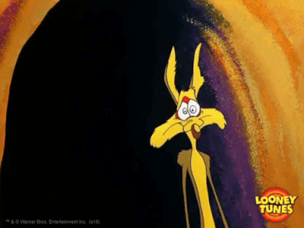
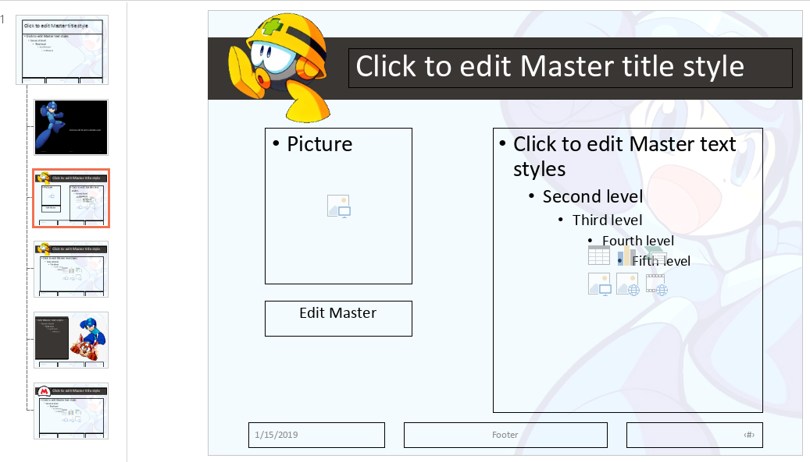
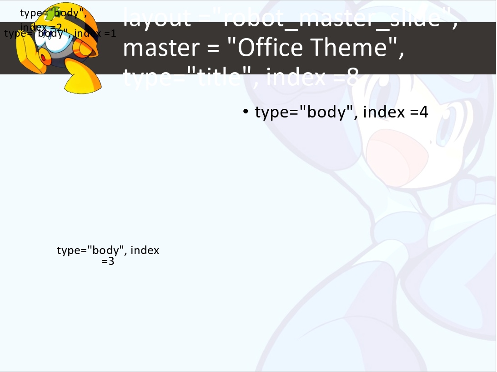
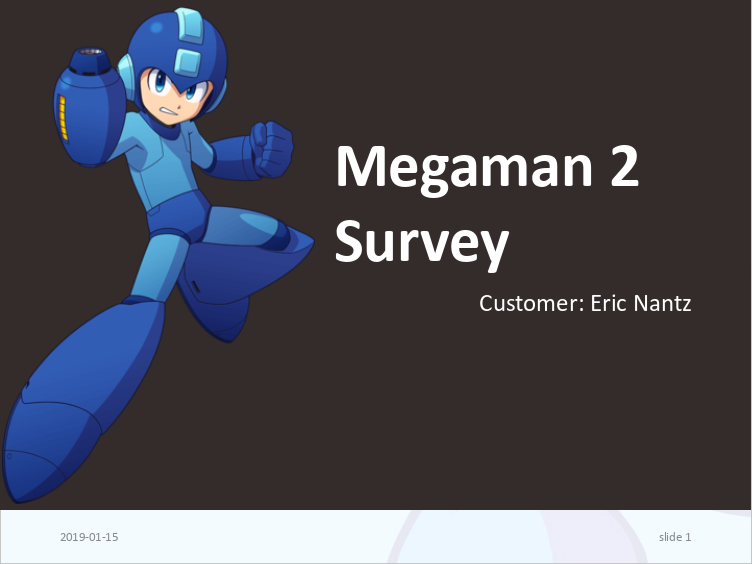
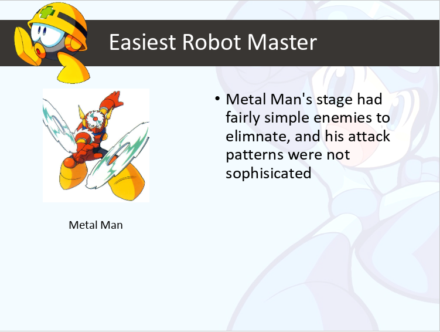

class: bg-main1

# A Few Disclaimers
<br>
<br>
--

## I am not the author of this excellent package

<br>
Just a very happy user
<br>

--
<br>

## I am not a fan of PowerPoint!



---
class: bg-main1

# However...

<blockquote class="twitter-tweet" data-lang="en"><p lang="en" dir="ltr">If you&#39;re doing <a href="https://twitter.com/hashtag/rstats?src=hash&amp;ref_src=twsrc%5Etfw">#rstats</a> R Markdown involving knitting to MS Word/PowerPoint and you are not using <a href="https://twitter.com/DavidGohel?ref_src=twsrc%5Etfw">@DavidGohel</a>&#39;s packages, then you are doing it wrong. The amount of functionality in `flextable` alone is mind blowing. Have you looked that, <a href="https://twitter.com/revodavid?ref_src=twsrc%5Etfw">@revodavid</a>?</p>&mdash; JD Long (@CMastication) <a href="https://twitter.com/CMastication/status/1042074521401020417?ref_src=twsrc%5Etfw">September 18, 2018</a></blockquote>
<script async src="https://platform.twitter.com/widgets.js" charset="utf-8"></script>


<blockquote class="twitter-tweet" data-lang="en"><p lang="en" dir="ltr">I&#39;ve been using officer a lot this year for some projects involving <a href="https://twitter.com/hashtag/shiny?src=hash&amp;ref_src=twsrc%5Etfw">#shiny</a> &amp; powerpoint slides automation and I&#39;ll be attending your <a href="https://twitter.com/hashtag/rstudioconf?src=hash&amp;ref_src=twsrc%5Etfw">#rstudioconf</a> workshop!  <a href="https://twitter.com/xieyihui?ref_src=twsrc%5Etfw">@xieyihui</a> I&#39;m happy to pitch in if you are still looking 👍</p>&mdash; The R-Podcast (Eric) (@theRcast) <a href="https://twitter.com/theRcast/status/1073441479257980928?ref_src=twsrc%5Etfw">December 14, 2018</a></blockquote>
<script async src="https://platform.twitter.com/widgets.js" charset="utf-8"></script>


---
class: split-two white

.column.bg-main1[
.content[

<br>
.center[
[davidgohel.github.io/officer/](https://davidgohel.github.io/officer/)

### Authored by David Gohel
]
]
]

.column.bg-main2[
.content[
## Create Microsoft Word and PowerPoint files directly from `r icon::fa("r-project")`
<br>
<br>

## No dependencies on other programs/libraries

### Utilizes [Open XML format](https://support.office.com/en-us/article/open-xml-formats-and-file-name-extensions-5200d93c-3449-4380-8e11-31ef14555b18) introduced in MS Office 2007

<br>
<br>

## `r emo::ji("x")` Not part of the `r icon::fa("r-project")` Markdown ecosystem

* Functional interface that is pipe-friendly

]
]

---
class: split-60 with-border

.column.bg-main1[
.center[
# Motivating Example
]


]

.column.bg-main3[
.center[
# It's Survey Time!
]

## Elicit feedback on [Megaman 2](https://megaman.fandom.com/wiki/Mega_Man_2)
<br>
<br>

### Which robot master was the most difficult?

### Which robot master was the easiest?

### How many attempts before defeating each robot master?

<br>

## Challenge: Executives want a __very specific__ slide template used!
]

---
layout: true
class: split-10 with-thick-border border-gray

.row.center[
.content.vmiddle[
# A workflow with `officer`
]
]

.row[.content[
.split-three[
.column.bg-main1[.content[
.center[
# Configure Template
]
.center[
### Master Layout
]
.img-fill.nopadding[]
]
]

.column.bg-main1[.content[
.center[
# Import to `r icon::fa("r-project")`
]
```{r, eval=F}
library(officer)
read_pptx("megaman.pptx") %>%
  layout_summary()
```
.font2[
Parse slides metadata
]
```{r, eval=F}
annotate_base(
  "megaman.pptx", 
  "megaman_annotated.pptx"
)
```
.font2[
Create annotated slide deck
]
]
]

.column.bg-main1[.content[
.center[
# Create Slides!
]
```{r, eval=F}
my_pres %>%
  
  add_slide("title_slide", "Office Theme") %>%
  ph_with_text("ctrTitle", "Megaman 2 Survey") %>%
  
  add_slide("robot_master_slide", "Office Theme") %>%
  ph_with_text("title", "Easiest Robot Master") %>%
  ph_with_img("pic", "metalman.jpg") %>%
  ph_with_text("body", index = 3, str = "Metal Man") 

print(my_pres, "output.pptx")
```

]
]
]]]

---

class: gray-row2-col2 gray-row2-col3

---

class: gray-row2-col1 gray-row2-col3
count: false

---

class: gray-row2-col1 gray-row2-col2
count: false

---

count: false

---
layout: false
class: split-10

.row.bg-main1.white[.content.vmiddle[
# Importing Slides
]]

.row[
.split-40[
.column.bg-main1[.content[
```{r eval=FALSE}
library(tidyverse) #<<
library(officer)

my_pres <- read_pptx("megaman.pptx) #<<
```
]]

.column.bg-main1[.content[
## Initialize foundation

### File argument optional (`officer` ships with minimal template)

### `read_pptx` creates an R object representing a PowerPoint file
<br>

### All functions for manipulating slide content take this object as __first__ parameter
<br>

.center[

<br>
Pipe-friendly!
]

]]]]]

---
class: split-10

.row.bg-main1.white[.content.vmiddle[
# Under the (layout) hood
]]

.row[
.split-40[
.column.bg-main3[.content[
```{r eval=FALSE}
library(tidyverse)
library(officer)

my_pres <- read_pptx("megaman.pptx")

layout_summary(my_pres)
```

```{r echo=FALSE}
options(tibble.width = Inf, width = 150)
res <- layout_summary(my_pres)
as_tibble(res)
```

]]

.column.bg-main4[.content[

## Each slide layout is a template under a __Master Layout__

### Defines placeholder formatting attributes, positions, and other static elements

### All new slides must originate from one of these layouts

<br>

## How to change placeholders in a layout?

### Only through PowerPoint directly `r icon::ii_sad()`


]]]]]


---
class: shuriken-reverse-100

.blade1.bg-main1[.content.vmiddle.center[
## Open PowerPoint `r icon::fa_arrow_right()` View `r icon::fa_arrow_right()` Slide Master
]]
.blade2.bg-light-blue[.content.white.vmiddle.center[

]]
.hole.bg-black[.content.center.nopadding[

]]
.blade3.bg-yellow[.content.vmiddle.center.color-main1[
## Hopefully someone else can do this for you...
]]
.blade4.bg-light-blue[.content.vmiddle.white.center[
]]


---
class: split-10

.row.bg-main1.white[.content.vmiddle[
# About Placeholders
]]

.row[
.split-40[
.column.bg-main3[.content[
```{r eval=FALSE}
library(tidyverse)
library(officer)

my_pres <- read_pptx("megaman.pptx")
layout_properties(
  my_pres, 
  "robot_master_slide"
)
```

```{r echo=FALSE}
options(tibble.width = Inf, width = 150)
res <- as_tibble(layout_properties(my_pres, "robot_master_slide"))
select(res, type, id, ph_label)
```

]]

.column.bg-main4[.content[
```{r eval=F}
my_pres %>%
  add_slide("robot_master_slide", "Office Theme") %>%
  ph_with_text(
    "Metal Man", 
    type = "body", 
    index = 11
)
```

## Placeholders can be different types

<br>

## Typically multiple "body" placeholders in a layout

<br>

### All content functions have an `index` parameter that must be specified in these cases

## How did I know that index value`r icon::fa_question()`

]]]]]

---

class: shuriken-reverse-100

.blade1.bg-main1[.content.vmiddle.center[
### `annotate_base("megaman.pptx", "ann.pptx")`
]]
.blade2.bg-light-blue[.content.white.vmiddle.center[

]]
.hole.bg-black[.content.center.nopadding[

]]
.blade3.bg-blue[.content.vmiddle.center.color-main1[
## Use the `index` values in your code!
]]
.blade4.bg-light-blue[.content.vmiddle.white.center[
]]

---
class: split-10

.row.bg-main1.white[.content.vmiddle[
# Let's make some slides
]]

.row[
.split-60[
.column.bg-main3[.content[
```{r eval=FALSE}
my_pres <- read_pptx("megaman.pptx")

my_pres <- my_pres %>%
  # add title slide
  add_slide("title_slide", "Office Theme") %>%
  ph_with_text(type = "ctrTitle", str = "Megaman 2 Survey") %>%
  ph_with_text(type = "subTitle", str = "Customer: Eric Nantz") %>%
  ph_with_text(type = "dt", str = format(Sys.Date())) %>%
  ph_with_text(type = "sldNum", str = "slide 1")

print(my_pres, "result.pptx")
```
]]

.column.bg-main4[.content.center.nopadding[

]
]]]]]

---
class: split-10

.row.bg-main1.white[.content.vmiddle[
# Let's make some slides
]]

.row[
.split-60[
.column.bg-main3[.content[
```{r eval=FALSE}
# easiest robot master
my_pres <- my_pres %>%
  add_slide("robot_master_slide", "Office Theme") %>%
  ph_with_text(type = "title", str = "Easiest Robot Master") %>%
  ph_with_img(type = "pic", src = "metalman.jpg") %>%
  ph_with_text(type = "body", index = 3, str = "Metal Man") %>%
  ph_with_text(
    type = "body", 
    index = 4, 
    str = "Metal Man's stage had fairly simple enemies to eliminate, and his attack patterns were not sophisicated")

print(my_pres, "result.pptx")
```
]]

.column.bg-main4[.content.center.nopadding[

]
]]]]]

---

class: split-10 with-thick-border

.row.bg-main1.white[.content.vmiddle[
# Another option for placeholders
]]

.row[
.split-50[
.column.bg-main3[.content[
.center[
## `ph_*()`
]

### Position, formatting defined by PowerPoint
<br>
### With right index value, it is very dependable
]]

.column.bg-main3[.content[
.center[
## `ph_*_at()`
]
### Adds a __new__ placeholder at coordinates supplied in function
<br>
### Ability to add formatted text via `fp_text` objects
<br>
### Getting right position can be tedious
]]
]
]

---
class: bg-main2
# Additional Capabilities

--

## Vector-based graphics via the [`rvg`](https://github.com/davidgohel/rvg) package

<br>

### Ability to edit graph features in PowerPoint or Excel directly

--
<br>

## Tables via the [`flextable`](https://davidgohel.github.io/flextable/) package
<br>

### Custom definitions for cell contents and formatting using similar philosophy

<br>
### Compatible with R Markdown too!

---
class: bg-main4

# Additional Resources

### [`officer` package documentation](https://davidgohel.github.io/officer/index.html)
<br>

### [Crafting a PowerPoint Presentation wtih R](http://lenkiefer.com/2017/09/23/crafting-a-powerpoint-presentation-with-r/) and [PURRRty PowerPoint with R](http://lenkiefer.com/2017/09/27/use-purrr/) by [Len Kiefer](https://twitter.com/@lenkiefer)

<br>

### [`officer` tag](https://stackoverflow.com/questions/tagged/officer) on [StackOverflow](https://stackoverflow.com/)

